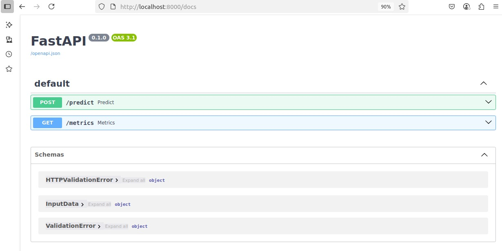
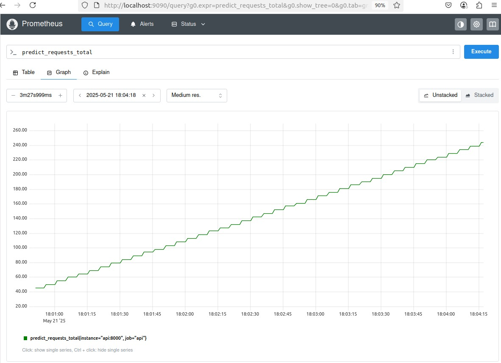
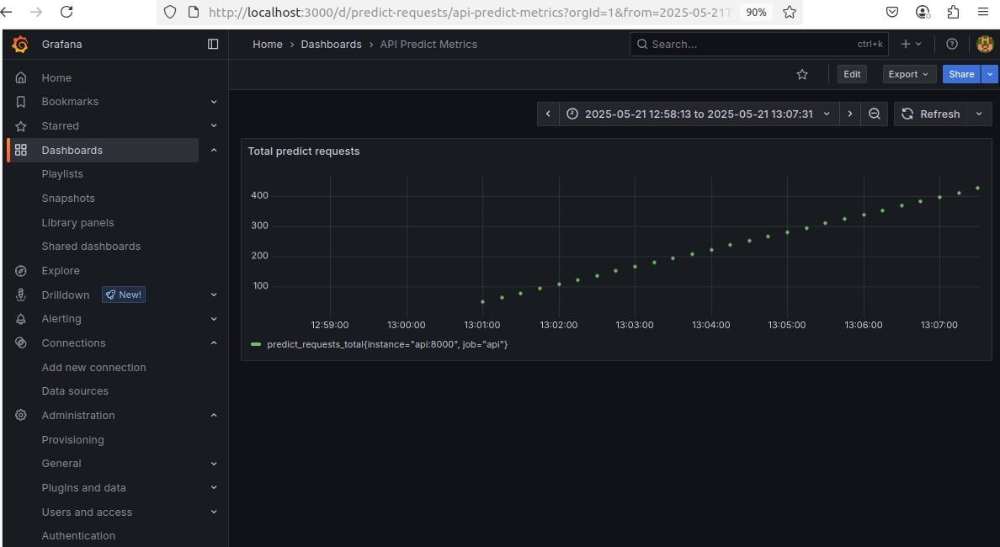
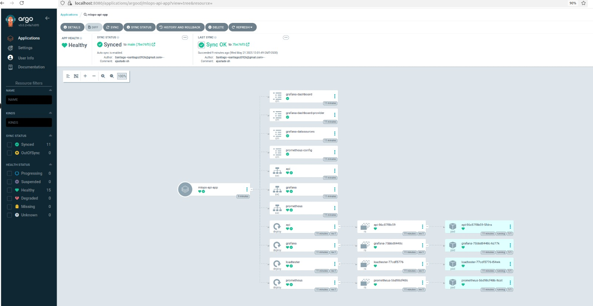

# Taller: CI/CD y GitOps para Despliegue de API de IA

Este proyecto implementa una arquitectura completa para el despliegue de una API de predicción basada en IA utilizando:

- **FastAPI** para servir el modelo
- **Docker** para contenerizar los servicios
- **GitHub Actions** como pipeline de CI/CD
- **DockerHub** como registro de imágenes
- **Prometheus & Grafana** para observabilidad
- **Argo CD** para GitOps y sincronización automática
- **Minikube** como entorno de Kubernetes local

---

## 📂 Estructura del Proyecto

```
TALLER CI CD MLOPS/
├── .github/workflows/
│   └── ci-cd.yml                    # Workflow CI/CD para entrenar, construir y subir imagen
├── api/
│   ├── app/
│   │   └── main.py                  # API FastAPI con /predict y /metrics
│   │   └── model.pkl                    # Modelo entrenado (generado por train_model.py)
│   ├── Dockerfile                   # Dockerfile de la API
│   ├── requirements.txt            # Dependencias de la API
│   └── train_model.py              # Script que entrena el modelo
├── loadtester/
│   ├── main.py                     # Script para enviar requests /predict continuamente
│   ├── Dockerfile                  # Dockerfile del LoadTester
│   └── requirements.txt
├── argocd/
│   └── install.yaml                # (Opcional) Instalación offline de Argo CD
├── manifests/                      # Todos los manifiestos de Kubernetes declarativos
│   ├── argo-cd/app.yaml            # Definición de la aplicación para Argo CD
│   ├── grafana-config/datasources.yaml
│   ├── grafana-config.yaml         # ConfigMap para datasources
│   ├── grafana-dashboard.yaml      # ConfigMap para dashboard con métricas
│   ├── grafana-dashboard.json      # Contenido JSON del dashboard
│   ├── grafana-dashboard-provider.yaml     # Indica a Grafana dónde cargar automáticamente los dashboards desde archivos JSON
│   ├── grafana-deployment.yaml     # Deployment y Service de Grafana
│   ├── prometheus-deployment.yaml  # Deployment y Service de Prometheus
│   ├── prometheus.yaml             # ConfigMap para Prometheus (targets)
│   ├── api-deployment.yaml         # Despliegue y servicio de la API FastAPI
│   ├── script-deployment.yaml      # Despliegue de LoadTester
│   └── kustomization.yaml          # Ensambla todos los manifiestos declarativos
```

---

## ⚖️ Descripción de Componentes

### API FastAPI (`api/`)

- `train_model.py`: entrena un modelo simple sobre el Dataset de IRIS con Scikit-learn
- `main.py`: define los endpoints `/predict` y `/metrics`
- `model.pkl`: archivo generado con el modelo entrenado

### LoadTester (`loadtester/`)

- Script que hace peticiones cada segundo al endpoint `/predict`

### Manifiestos Kubernetes (`manifests/`)

- `api-deployment.yaml`: despliega la API
- `script-deployment.yaml`: ejecuta el LoadTester como Pod
- `prometheus-deployment.yaml`: configura Prometheus con objetivo a la API
- `grafana-deployment.yaml`: monta dashboard preconfigurado
- `grafana-dashboard.yaml`: dashboard JSON embebido como ConfigMap
- `argo-cd/app.yaml`: Argo CD sincroniza con esta definición

### CI/CD (`.github/workflows/ci-cd.yml`)

- Corre al hacer `push` a `main`
- Entrena modelo, construye imagen y la sube a DockerHub (`latest` y `test-ci`)

---

## 🧰 Proceso de Despliegue y Prueba

### 1. Clona el proyecto

```bash
git clone https://github.com/zafrar0926/Taller-CI-CD-MLOPS.git
cd Taller-CI-CD-MLOPS
```

### 2. Asegura tener configurado Minikube

```bash
minikube start
```

### 3. Aplica los manifiestos con Kustomize

```bash
kubectl apply -k manifests/
```

### 4. Revisa los pods

```bash
kubectl get pods
```

### 5. Accede a Grafana

```bash
kubectl port-forward service/grafana 3000:3000
```

Accede a: [http://localhost:3000](http://localhost:3000)Usuario: `admin`Contraseña: obtenla con:

```bash
kubectl -n default get secret grafana -o jsonpath="{.data.admin-password}" | base64 -d && echo
```

### 6. Visualiza la métrica `predict_requests_total`

Ya está en el dashboard automáticamente cargado por ConfigMap

---

## 🚀 Integración con GitHub Actions y Argo CD

- Cada `git push` entrena, construye y publica una imagen en DockerHub
- Argo CD detecta los cambios en `manifests/` desde Git y actualiza el clú ster
- Argo CD se puede acceder desde:

```bash
kubectl port-forward svc/argocd-server -n argocd 8080:443
```

Login: `admin` Contraseña:

```bash
kubectl -n argocd get secret argocd-initial-admin-secret -o jsonpath="{.data.password}" | base64 -d && echo
```

---

## 🚀 Proyecto Desplegado

El proyecto desplegado envia a traves de **Loadtester** solicitudes cada segundo al API. 

La interfaz de FastAPI se puede ve asi:


Una vez desplegado el proyecto, se pueden monitorear en **Prometheus** las metricas creadas, en este caso *predict_requests_total*:


O directamente desde **Grafana** con el dashboard desplegado automaticamente:


El proyecto completo puede monitorearse desde **Argo** que sincroniza automaticamente con el repositorio: *https://github.com/zafrar0926/Taller-CI-CD-MLOPS*




## 🛌 Recomendaciones Finales

- Evitar `latest` en producción: usar tags versionados
- Validar cada push observando los logs en GitHub Actions
- Agregar pruebas unitarias al pipeline CI si se desea extender
- Para facilitar el despliegue se incluye el archivo *recreate_all.sh*
    - Para su ejecucion solo requiere:
    **chmod +x recreate_all.sh && ./recreate_all.sh**
---

✅ **Desarrollado por: Santiago Zafra Rodriguez, Edwin A. Caro y Andres F. Matallana.**
